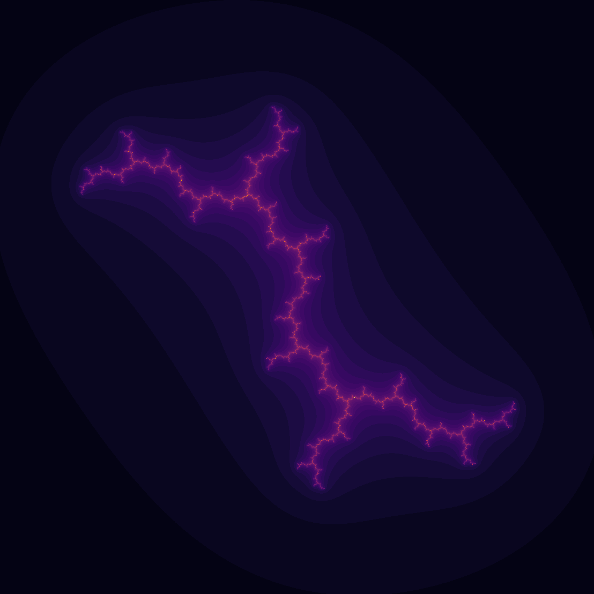
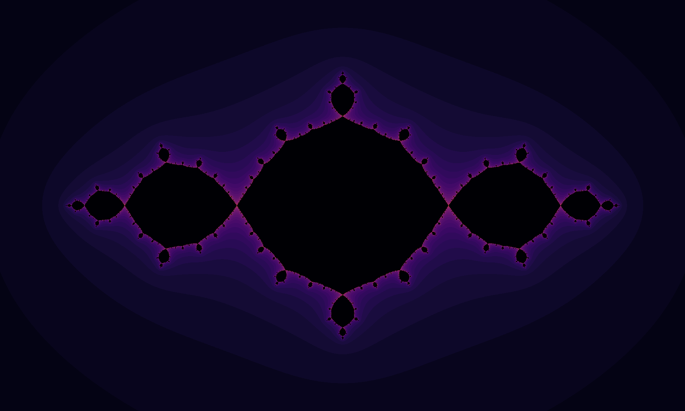
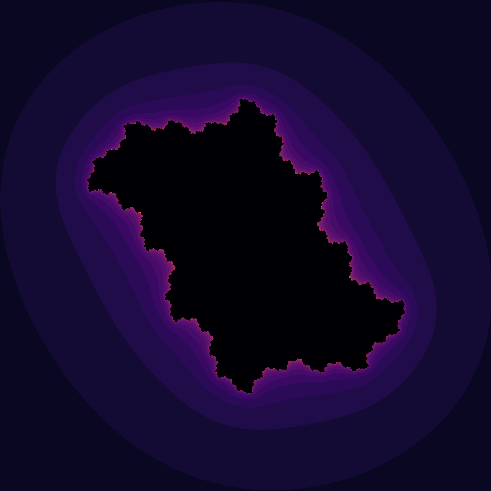
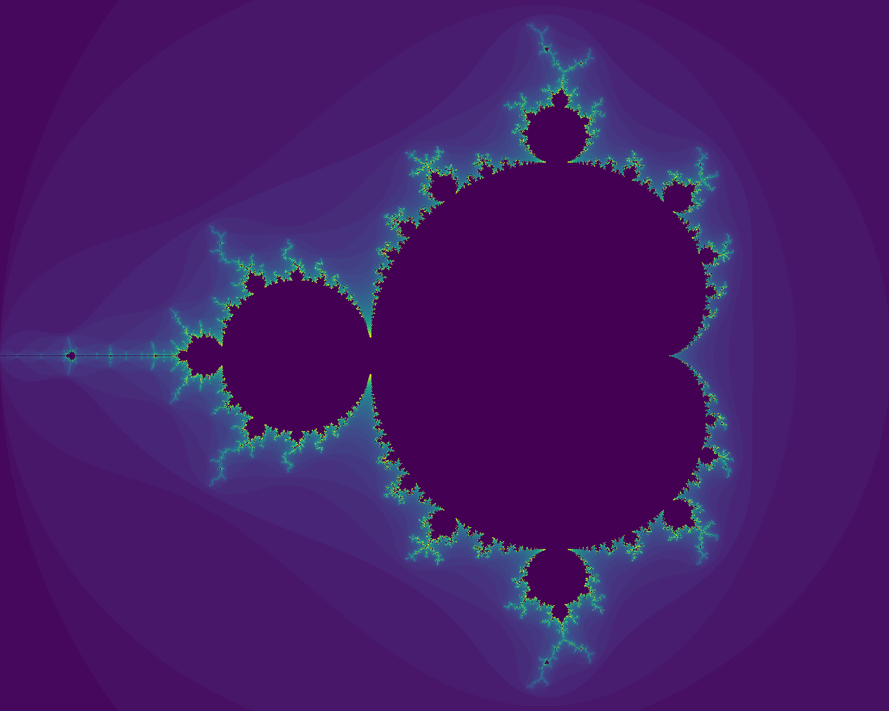

# complex-dynamics
Generate images of the Julia set and the Mandelbrot set.

## Examples

The Julia set of $Q_c(z)=z^2+i$

---

The Julia set of $Q_c(z)=z^2-1$

---

The Julia set of $Q_c(z)=z^2+0.5i$

---

The Mandelbrot set